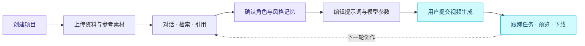
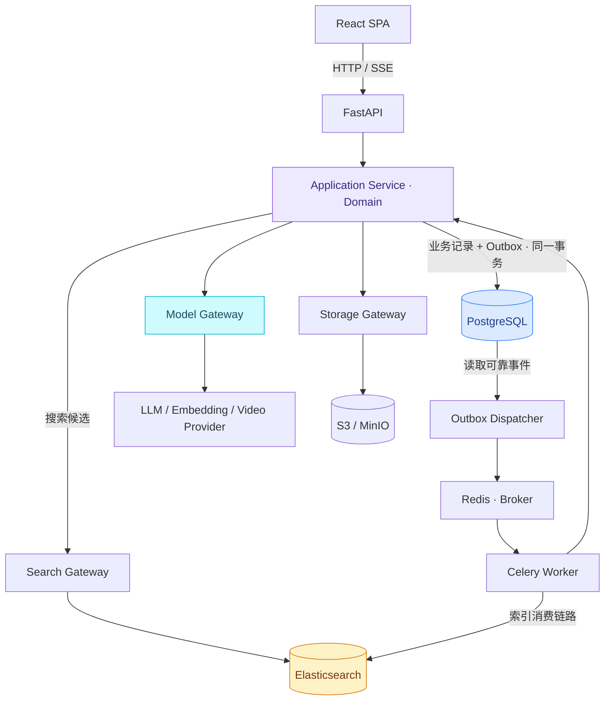

<div align="center">


<br />

**让创意拥有上下文，让每个项目拥有自己的记忆。**

从资料、对话到生成方案，为 AI 视频创作建立一条可追踪、可恢复的工作流。


[项目理念](#-为什么是-fluxora) · [能力规划](#-围绕一个项目完成创作) · [系统架构](#-架构一览) · [快速开始](#-快速开始) · [开发路线](#-开发路线) · [文档地图](#-文档地图)

</div>

> [!IMPORTANT]
> **当前处于 Foundation 阶段。** 仓库已有后端基础骨架与架构规范；视频生成、对话、RAG、项目记忆、Worker 和 React 前端尚未完整实现。下方产品流程与架构图展示目标设计，头图是品牌插画，并非产品截图。

## ✦ 为什么是 Fluxora

一次视频创作往往不止一个提示词：它还包含角色设定、参考素材、镜头要求、历史讨论，以及反复确认过的视觉风格。

Fluxora 希望把这些内容组织在同一个项目中，让对话能够找到资料，让生成能够引用上下文，让确认过的设定能够在下一次创作中继续使用。

- **项目就是边界。** 对话、知识、记忆与资源按项目隔离，避免不同创作的设定混在一起。
- **资料可以追溯。** RAG 回答引用文档版本与具体分块，区分“有项目证据”和“一般回答”。
- **记忆由人确认。** 模型可以建议，用户决定哪些内容成为项目长期设定。
- **生成过程可恢复。** 任务拥有持久状态、幂等提交与恢复路径；供应商超时不应导致盲目重复提交。
- **架构有明确约束。** 用文档、ADR 和验收规则统一协作，减少 AI 开发时自行选择另一套实现。

## ◈ 围绕一个项目完成创作



| 能力 | 目标体验 | 设计重点 |
| --- | --- | --- |
| 🎬 视频生成 | 选择模型、提示词与参考素材，提交并跟踪生成 | 异步任务、取消语义、未决结果核对、输出持久化 |
| 💬 项目对话 | 连续讨论创意，流式查看回答 | 消息持久化、SSE 重连、上下文预算 |
| 📚 知识库与 RAG | 上传 PDF、DOCX、TXT、Markdown，让回答有来源 | 解析定位、混合召回、版本校验、引用追踪 |
| 🧠 项目记忆 | 保存角色、世界观、视觉风格和创作要求 | 显式确认、修订历史、冲突处理、项目隔离 |
| 🗂️ 资源管理 | 统一查看参考图、资料与生成成片 | 私有对象存储、资源归属、短期签名访问 |
| 👥 项目协作 | OWNER 管理项目，MEMBER 参与创作 | PG 授权、成员撤销、跨项目访问防护 |

**首期范围：** 打通创作与生成闭环。时间线剪辑、模型训练、自治多智能体、跨项目共享和支付账本不在首期范围内。

## ⬡ 架构一览

**独立 React 前端 + FastAPI 模块化单体 + 异步 Worker。** API 与 Worker 复用同一套应用服务和领域规则，供应商差异由 Gateway 与 Adapter 隔离。



*图中的 Worker → ES 表示异步索引链路；具体实现仍经应用服务与索引适配器，不在 Worker 中复制业务规则。*

### 数据各司其职

| 组件 | 保存什么 | 关键约束 |
| --- | --- | --- |
| **PostgreSQL** | 用户、项目、权限、消息、记忆、任务、资源元数据、可靠事件 | **唯一业务事实数据源** |
| **Elasticsearch** | 分块与记忆的全文/向量检索索引 | 派生数据，可删除、重建与迁移 |
| **Redis** | 队列消息、短期流事件与限流数据 | 不保存唯一业务事实 |
| **S3 / MinIO** | 原始文件、图片、视频等二进制内容 | 业务归属与生命周期以 PG 为准 |

业务操作先提交 **PG + Outbox**，再由后台同步 ES。搜索命中只是候选，必须回查 PG 的项目权限、版本与删除状态。ES 同步失败不撤销已经完成的业务事务。

### 技术栈

| 层次 | 选型 | 当前情况 |
| --- | --- | --- |
| API | Python 3.12+ · FastAPI · Pydantic | 已有基础骨架 |
| 数据访问 | SQLAlchemy 2 async · asyncpg · Alembic | 已接入；身份与项目迁移已创建 |
| 日志与配置 | structlog · pydantic-settings | 已接入 |
| 前端 | React · TypeScript · Vite | 登录页和项目列表可由 Compose 启动 |
| 界面与请求 | Tailwind CSS · shadcn/ui · TanStack Query · React Router | 登录与项目列表已接入；工作台与其余页面待实现 |
| 检索 | Elasticsearch | 已有本地服务配置，业务待接入 |
| 异步执行 | Celery · Redis | 已选型；Redis 已有本地配置，Worker 待实现 |
| 文件存储 | S3 兼容存储 · MinIO | 已有本地服务配置，业务待接入 |
| AI 适配 | Model Gateway · 文本侧 LangChain | 已有部分端口，真实适配器待实现 |
| 工具链 | uv · Ruff · pytest；前端 pnpm | 后端与前端锁文件已配置 |

## ⚡ 快速开始

以下步骤用 Docker 启动当前 API 和前端开发服务器。登录页和项目列表可用；工作台和生成服务仍未实现。

### 1. 准备环境

- Docker 与 Docker Compose。
- 只在宿主机运行 API 或测试时，另外需要 Python **3.12+** 与 **uv**。
- Git、Make；本地需要空闲的 `5432`、`6379`、`9200`、`9000`、`9001`、`8000`、`5173` 端口。

```bash
git clone https://github.com/zzephyra/Fluxora.git
cd Fluxora
```

### 2. 用 Docker 启动前后端

首次启动复制环境模板；如果已有 `.env`，保留已有配置。`.env` 里的 `localhost` 数据库地址只给宿主机上的 `make run` 使用。API 容器会改用 Compose 网络里的 `postgres`。

```bash
cp -n .env.example .env
docker compose up -d --build
```

也可以只构建并启动数据库、API 和前端：

```bash
make up
```

Compose 提供 PostgreSQL、Redis、Elasticsearch、MinIO、API、文本补全进程和前端开发服务器。开发启动会先执行 Alembic，创建用户、会话、项目成员、项目删除事件、模型目录、目录审计和一次文本补全记录。对话、知识库、记忆、视频生成和资源表仍未创建。文本补全进程只领取已排队的文本调用；Celery 仍未接入。平台管理员只能由管理员命令设置，例如 `python -m app.modules.auth.cli --grant-platform-admin --email someone@example.com`。`MODEL_SECRET_REFS` 只填写密钥名称。接口地址和密钥放在未提交的 `MODEL_ENDPOINTS`，不要写入仓库。

### 3. 只在宿主机启动 API

PostgreSQL 仍由 Compose 提供。在 Fluxora 根目录执行：

```bash
make install
make migrate
make run
```

API 默认监听 `http://127.0.0.1:8000`。

### 4. 检查服务

```bash
curl http://127.0.0.1:8000/healthz
curl http://127.0.0.1:8000/readyz
```

| 地址 | 用途 |
| --- | --- |
| [前端](http://127.0.0.1:5173) | Vite 开发服务器，`/api` 代理到 API |
| [API 文档](http://127.0.0.1:8000/docs) | FastAPI Swagger UI，当前仅反映已实现接口 |
| [存活检查](http://127.0.0.1:8000/healthz) | API 进程是否存活 |
| [就绪检查](http://127.0.0.1:8000/readyz) | PostgreSQL 是否可用 |
| [MinIO Console](http://127.0.0.1:9001) | 本地对象存储控制台，凭据见 Compose |

> [!NOTE]
> `/healthz` 成功不代表数据库或模型服务已就绪。当前 `/readyz` 检查 PG。前端已有登录页和项目列表；工作台、对话、资料和生成仍未实现。

### 5. 运行现有检查

```bash
make test
cd backend
uv run ruff check .
uv run ruff format --check .
```

已有测试覆盖配置、健康检查、异常处理及部分边界/解析入口。通过这些检查不等于视频生成、RAG 或跨项目隔离已经完成验收。

<details>
<summary><strong>常用命令与启动排查</strong></summary>

<br />

| 命令 | 用途 |
| --- | --- |
| `make install` | 安装后端依赖 |
| `make run` | 启动带热重载的 API |
| `make migrate` | 执行 Alembic 迁移 |
| `make test` | 运行现有 pytest 测试 |
| `docker compose ps` | 查看基础服务状态 |
| `docker compose logs postgres` | 查看数据库启动日志 |
| `docker compose stop` | 停止基础服务，保留现有容器 |

- **数据库未就绪：** 检查 Compose 状态、5432 端口以及 `.env` 的 `DATABASE_URL`。
- **端口冲突：** 修改对应服务的端口映射，并同步应用连接配置。
- **找不到前端启动脚本：** 当前未创建 frontend 工程，暂不提供 `pnpm dev`。
- **索引或模型接口不存在：** 当前只有基础骨架，按开发路线逐阶段实现。

当前 Compose 未声明持久化卷；不要将其作为可靠的数据保存方案，重建或移除容器可能丢失开发数据。

</details>

> [!WARNING]
> Compose 中的示例密码、开放端口和 Elasticsearch 开发安全配置仅供本地使用。生产需要私网、认证、HTTPS、持久存储、备份与恢复验证，详见[运行规范](docs/specs/operations-and-acceptance.md)。

## ⌘ 仓库导航

下面仅列出当前已经存在的主要路径；规划中的 frontend、业务 modules 和 Worker 不标作已实现目录。

```text
Fluxora/
├── README.md                       # 项目介绍与启动入口
├── ARCHITECTURE.md                  # 产品与工程总约束
├── AGENTS.md                       # AI / 协作者修改规则
├── Makefile                        # 后端开发命令
├── docker-compose.yml              # 本地基础服务
├── .env.example                    # 配置示例
├── backend/
│   ├── app/
│   │   ├── main.py                 # FastAPI 入口
│   │   ├── api/                    # 健康检查、中间件、异常处理
│   │   ├── core/                   # 配置、日志、错误类型
│   │   └── infrastructure/         # DB 与 AI / 搜索 / 存储 / 解析端口
│   ├── alembic/                    # 迁移目录，当前为空基线
│   ├── tests/                      # 现有骨架测试
│   ├── pyproject.toml
│   └── uv.lock
└── docs/
    ├── assets/                     # README 品牌素材
    ├── adr/                        # 架构决策记录
    └── specs/                      # 可执行实现规范
```

## ◎ 开发路线

路线按依赖顺序推进，未勾选项目均为待完成，不代表发布日期承诺。

- [x] **架构基线**：明确技术栈、模块边界、PG / ES 职责、项目隔离与 ADR。
- [x] **后端基础骨架**：API 入口、配置、日志、错误处理、健康检查、DB 会话与空迁移。
- [x] **身份与项目后端**：登录、CSRF、OWNER/MEMBER、数据库迁移与项目隔离测试。
- [ ] **前端基础布局**：项目列表、工作台和其余首期页面。
- [ ] **生成闭环**：Outbox、Worker、供应商替身、任务状态机、资源落库与生成记录。
- [ ] **持久对话**：消息、SSE 恢复、模型配置与真实文本供应商。
- [ ] **知识库与 RAG**：文档解析、分块、索引同步、混合召回、引用与重建。
- [ ] **项目记忆**：用户确认、修订历史、冲突处理与受控召回。
- [ ] **上线验收**：真实视频供应商接入、隔离回归、恢复演练与生产部署。

## ▤ 文档地图

README 负责介绍和导航，具体规则在对应规范中维护。开始实现前，先读总架构，再按功能阅读细则。

| 想了解什么 | 阅读入口 |
| --- | --- |
| 系统边界、技术选型、模块如何协作 | [ARCHITECTURE.md](ARCHITECTURE.md) |
| AI 修改代码时必须遵守什么 | [AGENTS.md](AGENTS.md) |
| 为什么采用这些设计 | [架构决策 ADR](docs/adr/README.md) |
| 表归属、事务、并发与幂等 | [数据与事务](docs/specs/data-and-transactions.md) |
| 任务状态、Outbox、索引重建与恢复 | [任务与同步](docs/specs/tasks-and-events.md) |
| 接口、身份、权限、上传与 SSE | [API 与权限](docs/specs/api-and-access.md) |
| 检索、上下文、引用与记忆生命周期 | [RAG 与记忆](docs/specs/rag-and-memory.md) |
| 页面布局、组件、交互与缓存 | [前端规范](docs/specs/frontend.md) |
| 当前代码差距、运行限制、部署与验收 | [运行与验收](docs/specs/operations-and-acceptance.md) |

## ⌁ Cursor Project Rules

仓库已配置 [architecture-first.mdc](.cursor/rules/architecture-first.mdc)，使用 `alwaysApply: true`。建议在 Cursor 中直接打开 **Fluxora 根目录**，在规则设置中确认该规则显示为 **Always Apply**；规则格式与应用方式见 [Cursor 官方说明](https://cursor.com/docs/rules)。

规则要求 Agent 在分析、规划和修改前读取 `AGENTS.md`、`ARCHITECTURE.md` 和规范索引，再按任务读取相关细则及 ADR。跨模块事务、项目隔离、任务状态和 API 契约必须先核对，禁止擅自增加技术栈或扩大功能范围。

可以用“请说明本任务依据哪些架构文件、涉及哪个模块、准备如何验证，先不要改代码”检查读取情况。规则属于上下文指导，不替代 CI 与业务测试；本仓库配置已写入，是否在当前 Cursor 会话加载需在客户端确认。

## ↗ 参与开发

1. 阅读 [AGENTS.md](AGENTS.md)、总架构和受影响主题的规范，检查已有实现。
2. 明确模块、API、数据约束与状态迁移，优先复用现有 Service、Repository 和 Port。
3. 新增持久化结构带 Alembic 迁移；接口变更同步 OpenAPI；行为变更覆盖相关风险测试。
4. 改变数据库职责、状态机、模块边界或主要依赖时，先记录 ADR 并完成确认。
5. 提交说明写清改动、实际执行的验证及剩余限制，不把设计完成当作功能完成。

**共同守住的边界：** PG 是业务事实源；所有项目资源经过授权；供应商调用通过 Gateway；长任务异步执行；模型不能静默保存记忆或发起视频生成。

---

<div align="center">

**Fluxora · From context to cinema.**

<sub>让每次创作，都从项目已有的知识与设定出发。</sub>

</div>
